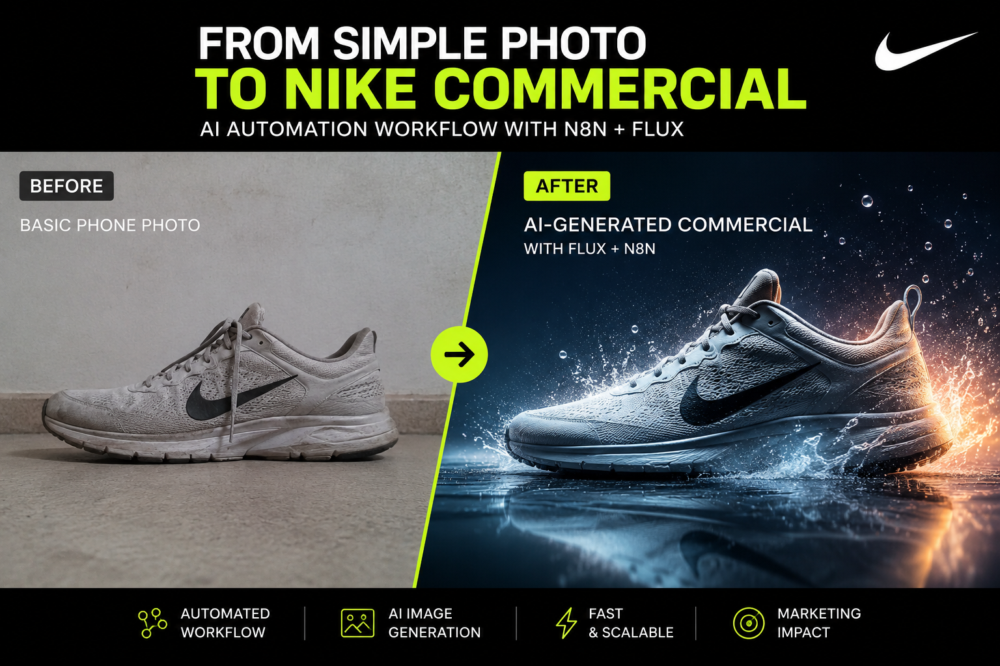
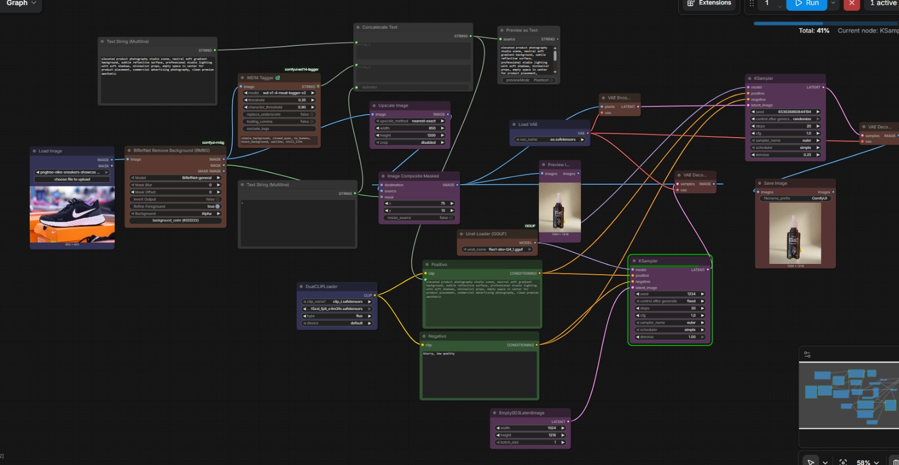

# studioflow-ai
AI Product Photography Pipeline built with ComfyUI and FLUX.
# StudioFlow AI

> AI Product Photography Pipeline built with ComfyUI and FLUX.

Transform a simple smartphone product photo into a professional commercial image using an automated AI workflow.

---

## 🚀 Overview

StudioFlow AI is a proof-of-concept workflow designed to automate product photography for e-commerce, social media, and marketing.

The workflow combines AI-powered image generation, prompt engineering, and image enhancement to dramatically reduce manual editing while maintaining high-quality results.

## 🎯 Project Goal

Build a reusable AI workflow that transforms ordinary product photos into professional commercial assets using ComfyUI and FLUX.

This project demonstrates AI workflow design, prompt engineering, and automation for marketing and e-commerce applications.
---
## 💡 Why I Built This

I built this project to explore how AI workflows can automate repetitive creative tasks while maintaining high-quality visual output.

Instead of focusing only on image generation, the goal was to design a reusable production pipeline that solves a real business problem.
## ✨ Features

- Automated product photography
- AI-generated commercial backgrounds
- Professional lighting
- High-resolution output
- Reusable ComfyUI workflow
- Scalable production pipeline
---
## 🛠️ Tech Stack

| Category | Technology |
|----------|------------|
| Workflow | ComfyUI |
| Image Generation | FLUX.1 Dev |
| Prompt Engineering | Florence-2 |
| Upscaling | ESRGAN |
| Image Editing | Photoshop |
| Documentation | Markdown |
## 📈 Expected Business Impact

- ⏱️ Reduce manual editing time by up to 90%.
- 💰 Lower production costs for product photography.
- 📦 Generate consistent images for large product catalogs.
- 🚀 Accelerate marketing content creation.
- 🎨 Maintain visual consistency across campaigns.
## 📸 Workflow

```text
Product Image
      │
      ▼
Background Removal
      │
      ▼
Prompt Enhancement
      │
      ▼
FLUX Image Generation
      │
      ▼
Image Upscaling
      │
      ▼
Commercial Output



```
## 👤 Author

**Héctor Hernández**

Digital Content Integrator | AI Content Creator

📍 Colombia

🌐 Portfolio: https://drive.google.com/drive/folders/1YmoV5EGiz_oAVwOIA6SbqGAqyZMr0RGx?usp=drive_link

💼 Open to AI Content Creator opportunities
